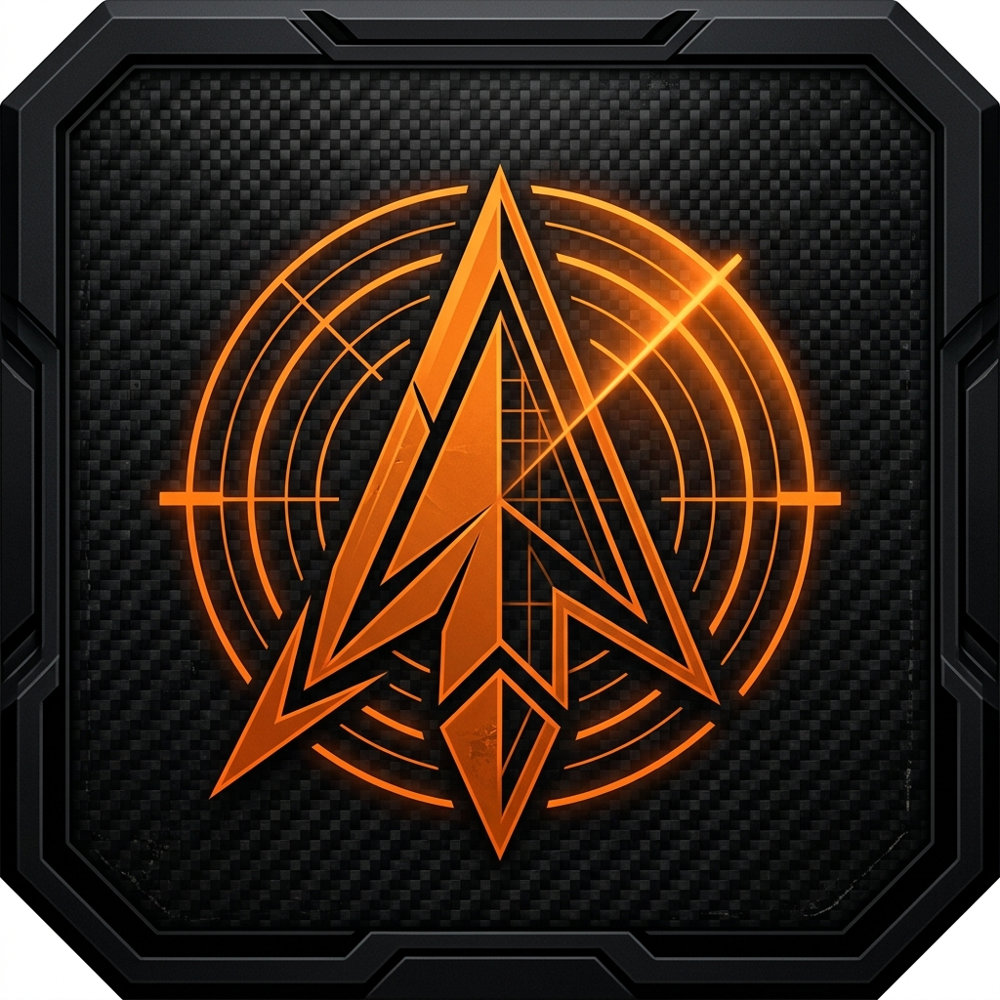

# <p align="center">TAK C2 - TACTICAL COMMAND DASHBOARD</p>

<p align="center">
  
</p>

<p align="center">
  
  
  
</p>

---

## ⚡ MISSION OVERVIEW

**TAK C2** is a professional-grade, autonomous tactical bridge designed for field operators. Unlike standard dashboards, this application is **100% standalone**, meaning it connects directly from your mobile device to any TAK-compliant server (FreeTAKServer, ATAK-Server, etc.) without requiring a middleman computer.

### 🛠 CORE CAPABILITIES

*   **Standalone Architecture**: Direct SSH & TCP integration. No bridge server required.
*   **Real-Time Telemetry**: Monitor server CPU, RAM, and Disk health via encrypted SSH.
*   **Tactical HUD**: Leaflet-based map with high-accuracy GPS tracking using native Android sensors.
*   **CoT Streaming**: Full support for Cursor-on-Target (CoT) XML packets (Ports 8087/8088).
*   **Mesh Ready**: Integrated UDP Multicast listener for peer-to-peer tactical awareness.
*   **Milspec UI**: Ultra-high contrast interface optimized for low-light and high-stress environments.

---

## 🚀 DEPLOYMENT GUIDE

### 1. Prerequisites
*   **Node.js & NPM**: For frontend building.
*   **Android SDK**: With `compileSdkVersion 36`.
*   **JDK 21**: Required for modern Kotlin/Gradle compilation.

### 2. Build Pipeline
To generate the tactical package (APK), run the following mission-critical commands:

```bash
# 1. Build frontend assets
npm run build

# 2. Synchronize with Android native layer
npx cap sync android

# 3. Compile tactical APK
cd android
.\gradlew.bat clean
.\gradlew.bat assembleDebug
```

### 3. Field Configuration
Once the APK is installed on your mobile device:
1.  Open the **TAK_C2** application.
2.  Tap the **Gear Icon** (Settings).
3.  Enter the **TAK_SERVER_IP** (Band A/B for dual-network support).
4.  Configure **SSH Credentials** for real-time telemetry.
5.  Set your **Callsign** and tap **SAVE & ACTIVATE**.

---

## 🛡 ARCHITECTURE SPECS

| Component | Technology | Role |
| --- | --- | --- |
| **Core** | React 18 + Vite | High-performance UI logic |
| **Native Bridge** | Capacitor 8.0 | Hardware access & OS integration |
| **Networking** | capacitor-tcp-socket | Direct TAK Server CoT streaming |
| **Security** | capacitor-ssh-plugin | Encrypted server management |
| **Mapping** | Leaflet + ArcGIS | Tactical geospatial visualization |

---

## ⚠️ OPERATIONAL DISCLAIMER

This software is designed for tactical situational awareness. Ensure that your TAK Server firewall is configured to allow incoming connections on ports **8087 (TCP)**, **8088 (TCP)**, and **22 (SSH)**. Always verify network accessibility before field deployment.

---

<p align="center">
  <i>"Precision in Data. Dominance in the Field."</i><br>
  <b>TAK_C2 Tactical Systems v8.0</b>
</p>
